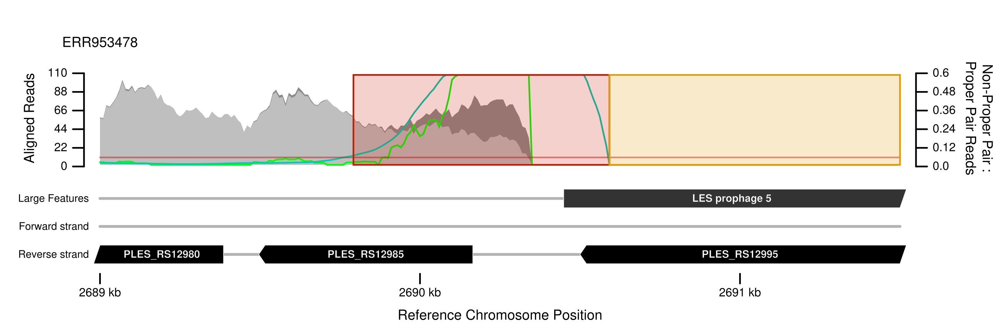

# Bacterial and Archaeal Genome Analyser

## Novel analyses and wrapped tools pipelined for convenient processing of genome sequences

#### David Williams

## Introduction

**The Bacterial and Archaeal Genome Analyser (BAGA, pronounced "baga") is a commandline application and Python 2 package (3 coming soon) for diverse analyses of genome sequence data.**

**Input data** can be complete genome sequences and/or paired end short reads from Illumina sequencers, typically whole genome shotgun libraries. **Tasks** might include variant calling and resolving population structure of resequenced pathogen isolates, analysis of evolution experiments and comparative genomics including phylogenomics.

BAGA is a wrapper for proven third party tools1, but also includes novel algorithms for identifying chromosomal rearrangements2, provides a means to create custom pipelines for reproducible analyses3, and can generate various informative plots4. It is under active development: new features and much more documentation will be appearing shortly.

1. e.g. [BWA](http://bio-bwa.sourceforge.net/) for short read alignment to longer sequences, [GATK](https://www.broadinstitute.org/partnerships/education/broade/best-practices-variant-calling-gatk-1) for variant calling and [ClonalFrameML](https://github.com/xavierdidelot/clonalframeml) for homologous recombination inference
2. Variant calls in such regions are unreliable and should be filtered because conventional variant calling algorithms would be unaware of potential misalignments caused by the loss of homology and might therefore report false positive variant calls e.g., near chromosomal rearrangements caused by mobile genetic elements. Detailed characterisation of those regions can be made by local de novo assemblies of reads and alignment of resulting contigs to the reference sequence
3. researchers can make use of version-control and digital object identifiers to generate citable and reproducible analyses for peer review publication
4. BAGA can plot all automatically indicated regions such as those prone to misalignment of short reads because of structural differences between a reference sequence and a sampled genome, e.g. a missing prophage (see point 2 above) 

## An example

A pipeline for inferring the population structure of a set of bacterial isolates implemented in BAGA could include the following steps. All required software is installed locally by BAGA except Genome Analysis Tool Kit from The Broad Institute which requires agreement with the license and registering in their forums. Each step can be achieved through a single BAGA command:

* Download a pre-determined reference genome sequence by providing it's NCBI RefSeq or GenBank accession number
* Download a group of paired-end short read datasets as FASTQ files from the European Short Read archive by providing a list of accession numbers.
* Prepare the short read data for analysis by removing artifacts left by library preparation using cutadapt
* Trim the short read data according to position-specific quality scores using [sickle](https://github.com/najoshi/sickle)
* Align each set of short reads to the reference genome using BWA
* Scan each alignment for evidence of structural rearrangements which are known to cause false positive variant calls using a built-in method
* Scan the reference genome for repeated regions allowing for some sequence divergence in which called variants may be ambiguous
* Use the Genome Analysis Tool Kit (GATK) to call variants

## Funding

Work on this software was started at [**The University of Liverpool**](https://www.liv.ac.uk), UK with funding from [**The Wellcome Trust**](http://www.wellcome.ac.uk/) (093306/Z/10) awarded to:

* Dr **Steve Paterson** (The University of Liverpool, UK)
* Dr **Craig Winstanley** (The University of Liverpool, UK)
* Dr **Michael A Brockhurst** (The University of York, UK)

License GPLv3+: GNU GPL version 3 or later. This is free software: you are free to change and redistribute it. There is NO WARRANTY, to the extent permitted by law.
