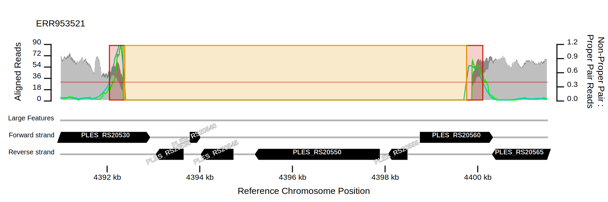
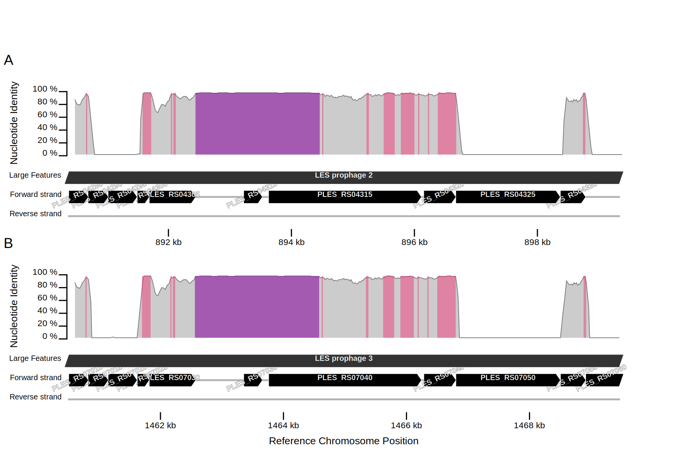
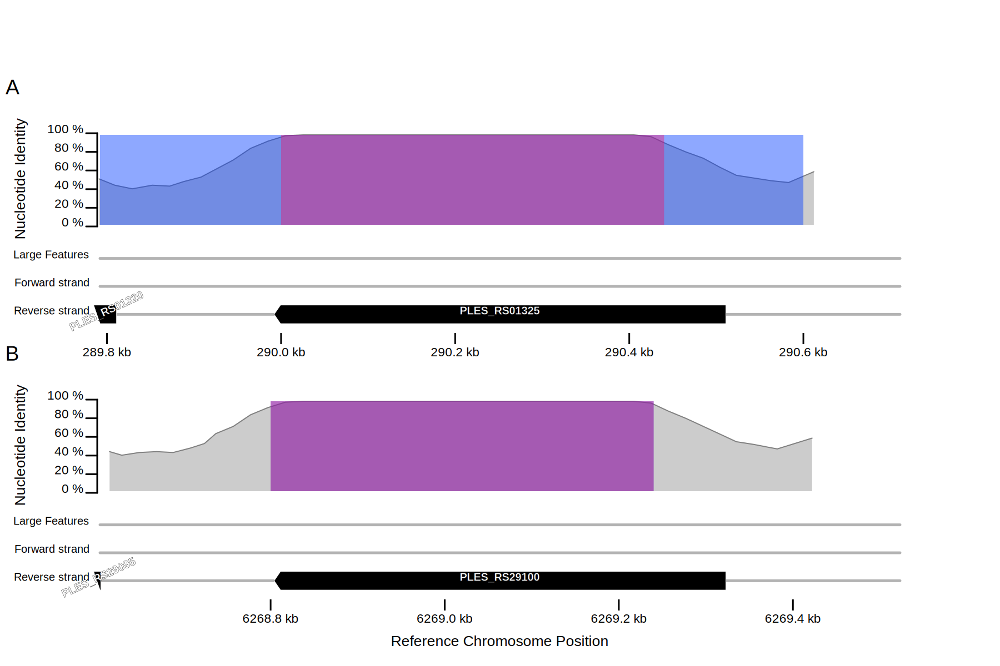
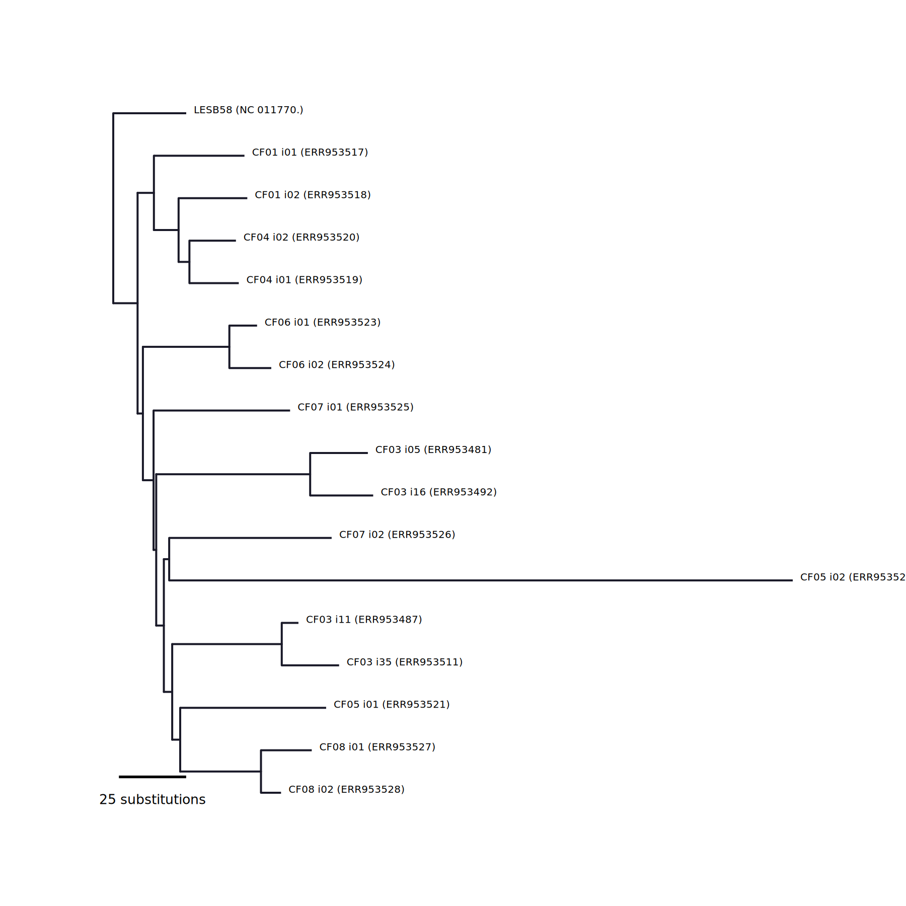

# Introduction

This guide describes how to use BAGA to reproduce some of the findings in a peer reviewed research paper published in the [American Journal for Respiratory Care and Critical Care Medicine](http://www.atsjournals.org/doi/abs/10.1164/rccm.201409-1646OC#.VqtfSknciV4 "Williams, D., Evans, B., Haldenby, S., Walshaw, M. J., Brockhurst, M. A., Winstanley, C. & Paterson, S. (2015) Divergent, Coexisting Pseudomonas aeruginosa Lineages in Chronic Cystic Fibrosis Lung Infections. Am. J. Respir. Crit. Care Med. 191, 775-785"). The study investigated the population structure of chronic *Pseudomonas aeruginosa* infections affecting the airways of a cohort of cystic fibrosis patients using paired-end Illumina short sequencing reads. If you have similar data and aims, you can adapt the instructions here to your own data. By pasting each command below into a terminal logged into a linux computer, you should be able to complete the analysis with little effort (check the [prerequisites](../#prerequisites) if you have problems with the "Dependencies" commands). 

The analysis starts with paired end short sequence reads (now [publically available](https://www.ebi.ac.uk/ena/data/view/ERP006191) but automatically downloaded here) for numerous isolates obtained from the sputum of each patient, and a previously published reference genome sequence. The result, after calling single nucleotide, insertion and deletion variants, is a phylogenetic tree describing the *P. aeruginosa* population structure within and between the patients. Horizontal genetic transfers *via* homologous recombination are also inferred. 

After applying a pipelined BAGA analysis based on these or other scripts, you might decide to publish your findings. Independent reproduction of your analysis by other people is easily achievable by depositing your BAGA scripts into a public data repository such as [FigShare](http://figshare.com) and including the [DOI](http://www.doi.org/) and citation in your report.

!!! note
    Short read data is bulky. Some steps in the following analysis are rapid but others can take an hour or longer. You could paste each command into a terminal and wait for completion *e.g.* leave it running overnight, or, provided the [prerequisites](../#prerequisites) are installed, the whole analysis can be run using a single script which you can download (right click [here](baga_guide1_script.sh) and 'save as...'). Reading through the material below should help you to understand what happened during the analysis.

!!! warning
    Because of large amounts of data input/output, unless you have time on your hands, do not attempt over network mounted storage! Use a local 'scratch' disk if running on a compute cluster.

## Third-party software tools

Included in the analysis are calls to numerous third party bioinformatics software packages. BAGA can ensure close or exact reproduction of your results by installing specific versions of them independently of those installed in your system (or the system of someone trying to reproduce your analysis). The version of each package can be specified including the revision number (commit) if it is under a version control system such as git. To do so, edit the file `versions.yaml` and replace the commit identifier or download URL according to the versions you'd like to use. In this example, we will keep things simple by using the default versions which are recent as of early 2016. In the future, BAGA will support additional short read aligners, variant callers and other software.

Although BAGA can save you time and help make your research reproducible, it is important to understand what each analysis step is doing! You should read the documentation to each wrapped software tool. Sometimes you should decide to use settings other than the default options. Currently only the CallVariants option provides a convenient way to do this for the GATK analyses which are probably the most sensitive steps in this analysis:

```bash
baga/baga_cli.py CallVariants \
--reads_name Liverpool \
--genome_name NC_011770.1 \
--calleach \
--arguments HaplotypeCaller '__sample_ploidy 1 __heterozygosity 0.001'
--GATK_jar_path ~/GenomeAnalysisTK.jar --JRE_1_7_path ~/Downloads/jre1.7.0_80/bin/java
```
The above command called the GATK HaplotypeCaller with the options `--sample_ploidy 1 --heterozygosity 0.001`. You must substitute the leading dashes (-) with underscores (_) so as not to confuse BAGA.

```bash
baga/baga_cli.py CallVariants \
--reads_name Liverpool \
--genome_name NC_011770.1 \
--calljoint \
--arguments GenotypeGVCFs '__heterozygosity 0.001'
--max_cpus 3 --max_memory 8 \
--GATK_jar_path ~/GenomeAnalysisTK.jar --JRE_1_7_path ~/Downloads/jre1.7.0_80/bin/java
```

The above command called the GATK GenotypeGVCFs with the options `--heterozygosity 0.001`. In the following analysis, the default options can be used so the `--arguments` is not used but is worth knowing about.

## Get the Genome Analysis Toolkit (GATK)

An exception to the automatic installations is GATK, used here to call small variants for each short read sequenced isolate relative to a complete and contiguous reference genome sequence. GATK requires each user to join an official support forum before downloading. Click on register in the red box to the left on the download page linked [here](https://www.broadinstitute.org/gatk/download/) (correct as of January 2016 - sometimes the Internet changes!). Save the file "GenomeAnalysisTK.jar" in your home folder.

GATK requires Java v1.7 but most up-to-date GNU/Linux distributions have at least v1.8. In some cases *e.g.* SuSE you can specify which version to use with:

```bash
sudo /usr/sbin/update-alternatives --config java
```
or
```bash
sudo /usr/sbin/update-alternatives --config jre_1.7.0
```

Alternatively, you can download v1.7 from [Oracle](http://www.oracle.com/technetwork/java/javase/downloads/java-archive-downloads-javase7-521261.html) if you agree to their license agreement. Download the '.tar.gz' for 'Java SE Runtime Environment 7u80', and save the contents to your computer *e.g.*, to `~/Downloads/jre1.7.0_80/bin/java`. When you tell BAGA to use GATK, you'll need to direct it to this Java binary: `--GATK_jar_path ~/GenomeAnalysisTK.jar --JRE_1_7_path ~/Downloads/jre1.7.0_80/bin/java`. This is included in the commands below.

## Get BAGA

The easiest way to get BAGA is with "git", a program commonly used in software development to keep track of changes which is also handy for downloading software:

```bash
mkdir baga_analysis
cd baga_analysis
git clone http://github.com/daveuu/baga.git
cd baga
git checkout 43c67c308c8fd20bd5f47e0e3b167dbd7629b3d8
cd ..
```

A specific version of BAGA now resides in a folder called "baga". This is ready to use. To further explore command line options for a particular Task, try: `baga/baga_cli.py CollectData -h`

Alternatively, open http://github.com/daveuu/baga.git in a web browser and click on "releases" and the "Source code" for release 0.2 to download a zipped archive of BAGA. Unzip that to the "baga_analysis" folder above. We will be running a file called "baga_cli.py" which is a command line interface to the various baga modules and is in the "baga" folder (or "baga-0.2" if you downloaded version 0.2). 

## 1. Collect the data

!!! note "Software for this task (installed by BAGA)"
    biopython

Install the required bioinformatics software for the CollectData task.
```bash
baga/baga_cli.py Dependencies \
--checkgetfor CollectData
```

Finally we can start the analysis! Every BAGA pipelined analysis starts by collecting the data. Short read data can be collected from a local folder, in which case BAGA really just makes a note of where it is, or can be downloaded from the European Nucleotide Archive by providing accession numbers. One or more paired read datasets can be collected together and each collected group is given a name. This `reads_group_name` will be used in subsequent steps as `sample_name` to refer to these data.

The download is 15 GB so may take a while. The raw read data will be put in a folder called "reads".

```bash
baga/baga_cli.py CollectData \
--reads_group_name Liverpool \
--reads_download ERR953517 ERR953518 ERR953481 ERR953487 ERR953492 ERR953511 ERR953519 ERR953520 ERR953521 ERR953522 ERR953523 ERR953524 ERR953525 ERR953526 ERR953527 ERR953528
```

A new file should have been made called 'baga.CollectData.Reads-Liverpool.baga' which contains some metadata for this group of reads for BAGA to read later. If you decide to move your reads to somewhere other than where you downloaded them, tell BAGA to update 'baga.CollectData.Reads-Liverpool.baga' by using this command:
```bash
baga/baga_cli.py CollectData \
--reads_group_name Liverpool \
--reads_path /new/path/reads/*[12].fastq.gz
```

Similarly, assembled genome sequences can be provided in a local path or downloaded by providing the NCBI RefSeq or GenBank accession numbers. You can provide either, but BAGA will always download the latest RefSeq version, if available, else will fall back to the latest GenBank version (in the interests of reproducibility, it will be possible to either request the latest version or specify an older version in future baga versions).

For now, this means, if you provide the GenBank accession number, but there is a RefSeq version available the RefSeq version will be used, and you will need to specify the RefSeq accession during the analysis. We require *P. aeruginosa* LESB58 which has RefSeq accession number NC_011770.1 (the .1 suffix means version 1). Replace "my.email.address@me.com" with your email address. [NCBI require this information](http://www.ncbi.nlm.nih.gov/books/NBK25497/) so they can help if the download fails.

The chromosome sequence and some annotations will be saved to "baga.CollectData.Genome-NC_011770.1.baga" and loaded at various stages of analysis.

```bash
baga/baga_cli.py CollectData \
--genomes NC_011770.1 \
--email my.email.address@me.com
```

### Citations
- biopython: Cock, P., Antao, T., Chang, J., Chapman, B., Cox, C., Dalke, A., Friedberg, I., Hamelryck, T., Kauff, F., Wilczynski, B. & De Hoon, M. (2009) Biopython: Freely available Python tools for computational molecular biology and bioinformatics *Bioinformatics* **25** 1422-1423

## 2. Prepare the short read data

!!! note "Software for this task (installed by BAGA)"
    sickle, cutadapt, [biopython](http://biopython.org/wiki/Main_Page)

!!! note
    If you have already trimmed and cleaned up your short read data, skip to the next section but add the `--prepared` option.

Install the required bioinformatics software for the PrepareReads task.
```bash
baga/baga_cli.py Dependencies \
--checkgetfor PrepareReads
```

Take a random subsample each set of reads to achieve an average coverage of 80x. Read sets that are unnecessarily large will slow down subsequent analyses. In this case, we will generate an additional 5.8 GB. This and subsequent tasks will create additional 'fastq.gz' files in the 'reads' folder with suffixes specific to the analysis that generated them.
!!! warning
    This can take several hours depending on data input/output speed of the storage medium. Do not attempt over network mounted storage! Use local 'scratch' disk if running on a compute cluster. Use the `CollectData ... --reads_path` command in step 1 if you decide to move your reads so BAGA knows where they went.

```bash
baga/baga_cli.py PrepareReads \
--reads_name Liverpool \
--subsample_to_cov 80 6601757
```

The file 'baga.PrepareReads.Reads-Liverpool.baga' will be created where BAGA stores analysis metadata.

Remove adaptor sequences and trim by position specific quality scores. This will generate an additional 27.6 GB of data(!). Adjust `--max_cpus 7` here and in future commands to the number of processes you'd like to run at once. If you have a quad core CPU a value of 3 or 4 should be fine.
```bash
baga/baga_cli.py PrepareReads \
--reads_name Liverpool \
--adaptors --trim \
--max_cpus 7
```

!!! note
    If you find yourself running out of disk storage space, you can issue the `--delete_intermediates` command below to delete intermediate data files which will no longer be required.

The only drawback deleting intermediates is if you decide to repeat a step with a different setting: some earlier, intermediate analyses might have to be repeated which could be time consuming. Use `baga/baga_cli.py AlignReads -h` to see if other tasks can also delete intermediate data files. Running the command below now should save about 8GB of space.
```bash
baga/baga_cli.py PrepareReads \
--reads_name Liverpool \
--delete_intermediates
```

To save even more space you could delete the original downloaded files (`--delete_intermediates` will not touch these files to mitigate the risk of having to re-download the files).
```bash
rm ./reads/ERR953*_[12].fastq.gz
```

!!! note
    If BAGA finds data already generated when asked to perform a specific analysis, it will not repeat the analysis unless you include the option `--force`.

If your analysis is interrupted (*e.g.*, you run out of storage space), you could be left with truncated data files and it might be necessary to repeat the last command (or last few commands) with the `--force` option. For example, if GATK complains of 'BAM file has a read with mismatching number of bases and base qualities', or picard complains of a REGEX match failure on a read label, you probably created a BAM file from a truncated FASTQ file. You will need to regenerate the FASTQ file by rerunning earlier analysis tasks with the `--force` option.

### Citations
- sickle: Joshi, N. A. & Fass, J. N. (2011) Sickle: A sliding-window, adaptive, quality-based trimming tool for FastQ files
- cutadapt: Martin, M. (2011) Cutadapt removes adapter sequences from high-throughput sequencing reads *EMBnet.journal* **17** 1
- biopython: Cock, P., Antao, T., Chang, J., Chapman, B., Cox, C., Dalke, A., Friedberg, I., Hamelryck, T., Kauff, F., Wilczynski, B. & De Hoon, M. (2009) Biopython: Freely available Python tools for computational molecular biology and bioinformatics *Bioinformatics* **25** 1422-1423

## 3. Align short reads

!!! note "Software for this task (installed by BAGA)"
    [bwa](http://bio-bwa.sourceforge.net/), [samtools](https://samtools.github.io/), [picard](http://broadinstitute.github.io/picard), [pysam](https://pysam.readthedocs.org/en/latest/)

Install the required bioinformatics software for the AlignReads task.
!!! note
    SuSE GNU/Linux requires the following environment variables to be set before compiling SAMTools, which is required for the AlignReads task: `export LIBCURSES=-lncurses && export MAKEFLAGS="-e"`
```bash
baga/baga_cli.py Dependencies \
--checkgetfor AlignReads
```

Map the short read data to the reference genome using `BWA` and remove "optical" duplicate reads using `picard`. Alignment files (.bam) will be placed in the 'alignments/NC_011770.1' folder. This command will generate an additional 12 GB of data.
```
baga/baga_cli.py AlignReads \
--reads_name Liverpool \
--genome_name NC_011770.1 \
--align --deduplicate
```

You might need to adjust the command below to reflect the locations of your  GenomeAnalysisTK.jar and Java v1.7 files. If you do not specify `--JRE_1_7_path`, BAGA will use the `java` executable in the system `PATH` (which will be at least v1.8 on most up-to-date GNU/Linux distributions).
```
baga/baga_cli.py AlignReads \
--reads_name Liverpool \
--genome_name NC_011770.1 \
--indelrealign \
--GATK_jar_path ~/GenomeAnalysisTK.jar --JRE_1_7_path ~/Downloads/jre1.7.0_80/bin/java
```

### Citations
- bwa: Li, H. & Durbin, R. (2009) Fast and accurate short read alignment with Burrows–Wheeler transform *Bioinformatics* **25** 1754-1760
- samtools: Li, H., Handsaker, B., Wysoker, A., Fennell, T., Ruan, J., Homer, N., Marth, G., Abecasis, G. & Durbin, R. (2009) The Sequence Alignment/Map format and SAMtools *Bioinformatics* **25** 2078-2079
- pysam: The pysam developers (2015) https://github.com/pysam-developers/pysam
- picard: The picard developers (2015) https://github.com/broadinstitute/picard
## Introduction to the BAGA filters.
When a variant call is made by software like GATK, numerous assumptions are made. One assumption is that the positions where the reads align each correspond to a [unique orthologous region with conserved genomic position](#4-BAGA-filter-rearrangements "if you disagree, contact the author to discuss!") in the sampled genome. This assumption allows both an unambiguous description of the variant position *e.g.* 10 000 bp from dnaA (the conventional starting point in circular chromosomes in sequence databases), and of the nature of the variation in relative terms *e.g.* adenine (A) in the reference to guanine (G) in the sample.

Chromosomal [rearrangments](https://en.wikipedia.org/wiki/Chromosomal_rearrangement) (insertions, [deletions](https://en.wikipedia.org/wiki/Deletion_(genetics)), [translocation](https://en.wikipedia.org/wiki/Chromosomal_translocation), [inversions](https://en.wikipedia.org/wiki/Chromosomal_inversion) and [duplications](https://en.wikipedia.org/wiki/Gene_duplication)) that have occurred since a most recent common ancestor, affecting only one of the reference or sample sequences, can introduce ambiguity to variant calls. If an ancestral chromosomal rearrangement in the reference caused an additional version of the sequence around 10 000 bp to also occur at 20 000 bp, the report by GATK of an A to G substitution at 10 000 bp becomes ambiguous with repect to its position: it could really be at 20 000 bp.

Chromosomal [rearrangments](https://en.wikipedia.org/wiki/Chromosomal_rearrangement) also introduce "break points" where sequence homology between two chromosomes is interrupted. Reads can be aligned over these breakpoints when the majority of the read length is on one side. At the region spanning the breakpoint, differences reported by the variant caller are likely to be caused by non-homology and not mutations since a last common ancestor. Thus the report by GATK of an A to G substitution may not be a true variant.

There are analytical techniques to mitigate these potiential false positives. For repeated regions, if a read aligns perfectly to both regions, the BWA aligner assigns a low mapping quality score to each which allows them to be removed by conventional filters. Any variation between repeat units can lead to higher mapping quality scores. For break points, the dissimilarity over the non-homologous regions of a read are usually sufficient prevent the read mapping at all. If the other side of the breakpoint shares some similarity by chance or more distant homology, the read might be succussfully mapped and a variant called. But in both cases the risk of a false positive variant being called is high.

## 4. BAGA filter: rearrangements

!!! note "Software for this task (installed by BAGA)"
    biopython, [pysam](https://pysam.readthedocs.org/en/latest/), svgwrite, [spades](http://bioinf.spbau.ru/spades)

Install the required bioinformatics software for the Structure task.
```bash
baga/baga_cli.py Dependencies \
--checkgetfor Structure
```

BAGA exploits the Illumina paired-end fragment sequencing technology to detect areas of chromosomal rearrangements. The pairs of sequences correspond to each end of DNA fragments, the lengths of which are distributed closely around a mean. Along contiguous, co-linear regions between a short read sequenced chromosome and a complete reference chromosome, the pairs of sequences will align to the reference at distances that correspond to the fragment lengths. At rearrangement break-points, the distance between aligned sequence pairs will deviate further from the mean fragement length.

Algorithms such as [Break-Dancer](http://gmt.genome.wustl.edu/packages/breakdancer/index.html "Chen, K. et al., (2009) Nature Methods 6, 677 - 681")<sup>1</sup> aim to infer the exact nature of a structural rearrangement (insertion, translocation *etc.*). The BAGA rearrangements filter is slightly less ambitious in that it merely flags up regions likely to be affected by rearrangements for variant filtering. However, this approach is potentially more sensitive for rearrangement detection and coupled with local *de novo* assembly and pair-wise alignment of the resulting contigs can facilitate detailed characterisation of rearrangements. BAGA uses the "proper-pairs" classification determined by the BWA aligner, and checks the proportion of pairs labelled as such along the reference genome.

When checking for rearrangements, if the ratio of non-proper pair to proper pair assigned reads remains above the `--ratio_threshold` value, that region of read alignments is considered rearranged. This ratio tends to zero when the distance between aligned paired reads is close to the expectation according to the estimated mean fragment size. It increases to around one adjacent to rearrangements *e.g.*, within a sequencing DNA fragment's length of a large deletion in the sample (or insertion in the reference).

Lower values of `--ratio_threshold` are more sensitive to rearrangements but might include false positive rearrangements. For filtering regions affected by unreliable short read alignments for variant calling, lower values are more conservative (will exclude more false positive variants) but might cause omission of true positive variants. Allowing a preference for false positive rearrangements over false negatives would be a conservative approach with respect to increasing true variants in the final result. Default = 0.15

!!! note
    The `--ratio_threshold` that provides the best error rate (false vs true positive rearrangements) varies with each library preparation. Try different values and review the resulting plots comparing paying attention to clear rearrangements *e.g.* missing prophage (see below for further discussion).

```bash
baga/baga_cli.py Structure \
--reads_name Liverpool \
--genome_name NC_011770.1 \
--ratio_threshold 0.4 \
--check
```

This command will generate plots of each region containing putative rearrangements.
```bash
baga/baga_cli.py Structure \
--reads_name Liverpool \
--genome_name NC_011770.1 \
--plot
```
The plot below should be included in the output. The x-axis is the position on the reference chromosome; the left y-axis is read depth: light grey is depth of reads assigned to a 'proper-pair', dark grey, stacked above, are non-proper-pair; the ratio of non-proper pair to proper pair assigned reads is indicated by the light green line while the dark green line is a smoothed average of that ratio. When the smoothed ratio exceeds the `--ratio_threshold` (horizontal orange line), a red block is plotted to indicate a region of putative rearrangement. Orange blocks extend from red blocks were read depth is consistantly zero or small and patchy.

The plot shows a region in the LESB58 reference genome that is missing in the sampled genome starting at the beginning of the "prophage 5" feature. This is a break-point flanking an insertion in the reference and s a potential problem for the variant caller. The caller assumes a simple 1-to-1 orthologous relationship where each short read aligns to the reference but typically, read callers will not explicitly check this assumption.


`plots_structure/NC_011770.1/2689000_2691500_NC_011770.1__Liverpool__ERR953478.svg`

If you wanted to review the Structure plots for a subset of your reads group members, use the `--include_samples` option:
```bash
baga/baga_cli.py Structure \
--reads_name Liverpool \
--genome_name NC_011770.1 \
--include_samples ERR953524 ERR953528 \
--plot
```

Similarly `--exclude_samples` can be used to omit a selection from the group defined by `--reads_name`. Both `--include_samples` and `--exclude_samples` can be used with `--check` as well as `-plot`.

If you have found a region of particular interest but would like to plot it in a wider context than the chromosome region that BAGA automatically selects, you can define a region with the `--plot_range` option.
```bash
baga/baga_cli.py Structure \
--reads_name Liverpool \
--genome_name NC_011770.1 \
--include_samples ERR953521 \
--plot_range 4391000 4401500
```


`plots_structure/NC_011770.1/4391000_4401500_NC_011770.1__Liverpool__ERR953521.svg`


#### Citations
- biopython: Cock, P., Antao, T., Chang, J., Chapman, B., Cox, C., Dalke, A., Friedberg, I., Hamelryck, T., Kauff, F., Wilczynski, B. & De Hoon, M. (2009) Biopython: Freely available Python tools for computational molecular biology and bioinformatics *Bioinformatics* **25** 1422-1423
- svgwrite: Moitzi, M. (2014) https://bitbucket.org/mozman/svgwrite
- pysam: The pysam developers (2015) https://github.com/pysam-developers/pysam
- spades: Bankevich, A., Nurk, S., Antipov, D., Gurevich, A. A., Dvorkin, M., Kulikov, A. S., Lesin, V. M., Nikolenko, S. I., Pham, S., Prjibelski, A. D., Pyshkin, A. V., Sirotkin, A. V., Vyahhi, N., Tesler, G., Alekseyev, M. A. & Pevzner, P. A. (2012) SPAdes: A new genome assembly algorithm and its applications to single-cell sequencing *J. Comput. Biol.* **19** 455-477

## 5. BAGA filter: repeats

!!! note "Software for this task (installed by BAGA)"
    bwa, samtools, biopython, seq-align, [svgwrite](http://readthedocs.org/docs/svgwrite/), pysam

Install required software.
```bash
baga/baga_cli.py Dependencies --checkgetfor Repeats
```

This command attempts to find repeats in a complete reference genome sequence. It uses the BWA aligner to align all protein coding regions against each other allowing divergence greater than 98% nucleotide identity. It then performs optimal pairwise alignment at the protein sequence level using seq-align and attempts to extend the alignments outwards, stopping if nucleotide identity drops below 85%. Finally it scans these accurate optimal alignments for regions >= 98% nucleotide identity and retains their ranges. Variants within those longer than the mean sequencing fragment size can be viltered out below.
```bash
baga/baga_cli.py Repeats \
--genome_name NC_011770.1 \
--find
```

This command will plot the identified repeats in pairs for review: you can check whether it made sensible calculations, and compare several potiential reference genomes.
```bash
baga/baga_cli.py Repeats \
--genome_name NC_011770.1 \
--plot
```

The plot below should be included in the output. It shows two regions in the LESB58 reference genome that are very similar i.e., they form a repeat larger than the sequencing fragment size, although in this case not a tandem repeat. As stated above, the variant caller assumes a simple, unambiguous, 1-to-1 orthologous relationship where each short read aligns to one position the reference. This is not the case between identical and near-identical repeats in the reference genome, such as the regions shown in the plot. Variants called in these regions can be filtered out later in the pipeline.


`plots_repeats/NC_011770.1/07_0890380_0899330_vs_1460510_1469458.svg`

In the plot, **purple blocks** indicate regions of at least 98% nucleotide identity between the pair of regions (A and B) in the current plot, and that are longer than the average sequencing fragment insert size. Within these regions, variants called from aligned reads are deemed to be ambiguous with respect to chromosomal location (because the paired end fragment size is too short to resolve which repeat the reads should be aligned to). If you apply the baga repeats filter, variants in these regions will be marked in the VCF files and omitted from further analysis.

**Pink blocks** indicate regions of at least 98% nucleotide identity, but shorter than the average sequencing fragment insert size. Although part of repeated regions, your paired end reads should be able to resolve where in the chromosome these regions are and so the reads can be used to unambiguously call variants in these regions.

In the plot below, **blue blocks** indicate regions within which variants called from aligned reads are omitted on the basis of pair-wise nucleotide identity comparisons between other repeat pairs (in other plots). These blue blocks correspond to purple blocks in other figures where one of the two repeat regions displayed in the current figure is included. You should only see blue blocks for 'homologous groups' (regions sharing the same sequence at high identity) with three or more repeats because the plots are pair-wise. In contrast, sequence repeated once produces a single pair of regions shown in a single plot.


`plots_repeats/NC_011770.1/04_0289792_0290711_vs_6268604_6269523.svg`

Other aspects of these repeats plots include: for each region, percent nucleotide identity to the other repeat in the same plot (light grey; moving window average); open reading frames are indicated in the lower two lanes labelled with locus ID and where available, gene name. Large genomic elements such as prophage and genomic islands are indicated in the upper-most lane, when present. This information is taken from the genome annotation obtained from GenBank or RefSeq in the baga/baga_cli.py CollectData --genomes ACCESSION command.

!!! note
    For "rendering" the SVG output into high resolution raster files *e.g.*, .png, [InkScape](https://inkscape.org/en/) is recommended because it adheres closely to the SVG standard and seems to handle text placement better most. Aesthetic details can also be adjusted to your preferences. The included `inkview` program is convenient for browsing the many SVG files BAGA sometimes produces.

### Citations
- bwa: Li, H. & Durbin, R. (2009) Fast and accurate short read alignment with Burrows–Wheeler transform *Bioinformatics* **25** 1754-1760
- samtools: Li, H., Handsaker, B., Wysoker, A., Fennell, T., Ruan, J., Homer, N., Marth, G., Abecasis, G. & Durbin, R. (2009) The Sequence Alignment/Map format and SAMtools *Bioinformatics* **25** 2078-2079
- biopython: Cock, P., Antao, T., Chang, J., Chapman, B., Cox, C., Dalke, A., Friedberg, I., Hamelryck, T., Kauff, F., Wilczynski, B. & De Hoon, M. (2009) Biopython: Freely available Python tools for computational molecular biology and bioinformatics *Bioinformatics* **25** 1422-1423
- seq-align: Turner, I (2015) Smith-Waterman & Needleman-Wunsch Alignment in C. https://github.com/noporpoise/seq-align
- svgwrite: Moitzi, M. (2014) https://bitbucket.org/mozman/svgwrite
- pysam: The pysam developers (2015) https://github.com/pysam-developers/pysam


## 6. Call variants

!!! note "Software for this task"
    GATK (HaplotypeCaller)

The commands below will use the GATK Haplotype Caller to perform joint genotype calling with quality score recalibration and hard filtering as recommended in the [Best Practices](https://www.broadinstitute.org/gatk/guide/best-practices) work flow provided by the Broad Institute where the software was made. See the [Get the Genome Analysis Toolkit](#get-the-genome-analysis-toolkit-gatk) section above regarding the `--GATK_jar_path` and `--JRE_1_7_path` options.

!!! note
    The joint genotyping is appropriate if you think your samples will share variants relative to the reference genome. These might include the shared ancestry among your samples since the most recent ancestor in common with the reference genome. In an evolution experiment in which a well characterised "lab rat" strain has been evolved, sequencing may include a single isolate plus a pool of genomic DNA from several isolates from each replicate. In that case it would be more suitable to use single sample genotyping for each isolate and pool: replace `--calleach --calljoint` with `--callsingles`. For convenience, all pooled can be in a single `--reads_name` group and all isolates in another.

```bash
baga/baga_cli.py CallVariants \
--reads_name Liverpool \
--genome_name NC_011770.1 \
--calleach \
--calljoint \
--hardfilter \
--recalibrate \
--max_cpus 7 --max_memory 8 \
--GATK_jar_path ~/GenomeAnalysisTK.jar --JRE_1_7_path ~/Downloads/jre1.7.0_80/bin/java
```

After the command above has finished recalibrating the base scores, issue the command below to call variants using those recalibrated scores.
```bash
baga/baga_cli.py CallVariants \
--reads_name Liverpool \
--genome_name NC_011770.1 \
--calleach \
--calljoint \
--hardfilter \
--max_cpus 7 --max_memory 8 \
--GATK_jar_path ~/GenomeAnalysisTK.jar --JRE_1_7_path ~/Downloads/jre1.7.0_80/bin/java
```

!!! note 
    If your isolates are not expected to share variants relative to the reference genome sequence, which would be the case for single representatives of a set of experimental replicates, the 'joint genotyping' feature of GATK's HaploType caller would not be appropriate. Instead use `--callsingles` instead of `--calleach --calljoint` to perform the genotyping separately.

### Citations
- GATK
    * McKenna, A., Hanna, M., Banks, E., Sivachenko, A., Cibulskis, K., Kernytsky, A., Garimella, K., Altshuler, D., Gabriel, S., Daly, M. & DePristo, M. A. (2010) The Genome Analysis Toolkit: A MapReduce framework for analyzing next-generation DNA sequencing data *Genome Res.* **20** 1297-1303
    * DePristo, M. A., Banks, E., Poplin, R., Garimella, K. V., Maguire, J. R., Hartl, C., Philippakis, A. A., del Angel, G., Rivas, M. A., Hanna, M., McKenna, A., Fennell, T. J., Kernytsky, A. M., Sivachenko, A. Y., Cibulskis, K., Gabriel, S. B., Altshuler, D. & Daly, M. J. (2011) A framework for variation discovery and genotyping using next-generation DNA sequencing data *Nat. Genet.* **43** 491-498
    * Van der Auwera, G. A., Carneiro, M. O., Hartl, C., Poplin, R., del Angel, G., Levy-Moonshine, A., Jordan, T., Shakir, K., Roazen, D., Thibault, J., Banks, E., Garimella, K. V., Altshuler, D., Gabriel, S. & DePristo, M. A. (2013) From FastQ Data to High-Confidence Variant Calls: The Genome Analysis Toolkit Best Practices Pipeline From FastQ Data to High-Confidence Variant Calls: The Genome Analysis Toolkit Best Practices Pipeline *Curr. Protoc. Bioinform.* **43** 11.10.1-11.10.33

## 7. Apply BAGA filters

Install required software.
```bash
baga/baga_cli.py Dependencies --checkgetfor ComparativeAnalysis
```

Update the VCF files to mark suspect variants according to BAGA's rearrangements and repeats filters.
```bash
baga/baga_cli.py FilterVariants \
--reads_name Liverpool \
--genome_name NC_011770.1 \
--filters genome_repeats rearrangements
```

## 8. Multiple sequence alignment for comparative analyses

Ensure required software is installed (as for [part 7](#7-apply-baga-filters)). This command creates a multiple sequence alignment from nucleotide subtitutions, small deletions called by GATK and putative large deletions detected in the read-to-reference sequence alignments where no reads mapped. This implementation accounts for variant caller uncertainty by using "?" characters state and absent chromosome using "-". Although these are often both treated the same, as "missing data", during comparative analyses, they can have different implications when summarising total polymorphisms in subgroups of a sample.

By including the `--include_invariants` option, alignment columns without variants are also included. This makes a much larger file but allows for more accurate estimation of certain parameters during maximum likelihood reconstruction.
```bash
baga/baga_cli.py ComparativeAnalysis \
--reads_name Liverpool \
--genome_name NC_011770.1 \
--build_MSA \
--include_invariants
```

## 9. Infer Phylogeny

!!! note "Software for this task (installed by BAGA)"
    PhyML

Ensure required software is installed (as for [part 7](#7-apply-baga-filters)). This command will infer a tree-like phylogeny from the nucleic acid multiple sequence alignment using PhyML's tree search with the GTR substitution model. The output will be a phylogeny in Newick format which can be opened with tree viewing programs like [FigTree](http://tree.bio.ed.ac.uk/software/figtree/) or plotted using BAGA, described below.

```bash
baga/baga_cli.py ComparativeAnalysis \
--infer_phylogeny \
--path_to_MSA NC_011770.1__Liverpool_SNPs.phy \
--out_group NC_011770.
```

The `--out_group NC_011770.` command is intentionally missing the last digit because the label was truncated to 10 digits to appease the legendary [Phylip sequence format](http://evolution.genetics.washington.edu/phylip/doc/sequence.html).

### Citations
- PhyML: Guindon, S., Dufayard, J., Lefort, V., Anisimova, M., Hordijk, W. & O., G. (2010) New algorithms and methods to estimate maximum-likelihood phylogenies: assessing the performance of PhyML 3.0 *Syst. Biol.* **59** 307-21

## 10. Infer genetic imports

!!! note "Software for this task (installed by BAGA)"
    ClonalFrameML

Ensure required software is installed (as for [part 7](#7-apply-baga-filters)). ClonalFrameML can infer chromosomal regions that appear to have acquired variants from a lineage more divergent than the sample *via* homologous recombination, as opposed to mutation and inheritance *via* cell division.
```bash
baga/baga_cli.py ComparativeAnalysis \
--infer_recombination \
--path_to_MSA NC_011770.1__Liverpool_SNPs.phy \
--path_to_tree NC_011770.1__Liverpool_SNPs_rooted.phy_phyml_tree
```

### Citations
- ClonalFrameML: Didelot, X. & Wilson, D. J. (2015) ClonalFrameML: Efficient Inference of Recombination in Whole Bacterial Genomes *PLoS Comput. Biol.* **11** e1004041

## 11. Summarise: plot tree and generate tables

Right click on [this list](phylogeny_sample_names.txt) of sample labels and save to the folder where you are doing the analysis. Then plot the tree:
```bash
baga/baga_cli.py ComparativeAnalysis \
--plot_phylogeny \
--plot_transfers \
--path_to_tree NC_011770.1__Liverpool_SNPs_rooted.phy_phyml_tree \
--use_names "phylogeny_sample_names.txt" \
--genome_name NC_011770.1 \
--out_group NC_011770.
```


`NC_011770.1__Liverpool_SNPs_rooted_transfers.svg`

The [publication](http://www.atsjournals.org/doi/abs/10.1164/rccm.201409-1646OC#.VqtfSknciV4) claimed "divergent, coexisting *Pseudomonas aeruginosa* lineages in chronic cystic fibrosis lung infections". Isolate labels in the phylogeny that share the same prefix *e.g.,* CF03 were obtained from the same sputum sample from a single patient. A close look at the phylogeny shows four isolates from CF03 do not group together but form two distinct lineages, no more closely related to each other than to lineages from other patients: divergent but coexisting. The same can be said for patients CF05 and CF07.

In the full analysis, reads were generated from pooled, extracted DNA from 40 isolates per patient confirming highly structured populations. Seven of nine patients harboured two or more divergent lineages. Each lineage had maintained a degree of diversity within them that was supplemented by low rates of genetic exchange by homologous recombination within and between them.

Generate a table showing the total variants as filters are applied:
```bash
baga/baga_cli.py SummariseVariants \
--genome_name NC_011770.1 \
--reads_name Liverpool \
--filters GATK genome_repeats rearrangements \
--cumulative
```

Generate a table showing all variants:
```bash
baga/baga_cli.py SummariseVariants \
--simple  \
--genome_names NC_011770.1 \
--vcfs_paths variants/NC_011770.1/Liverpool__NC_011770.1_2_samples_hardfiltered_[SI]*s__F_genome_repeats__F_rearrangements.vcf
```
This will generate a comma separated values text file `Simple_summary_for_ERR953481_and_15_others__NC_011770.1.csv` which can be loaded into spreadsheet *e.g.*, [Libre Office](https://www.libreoffice.org/) Calc, for viewing. The table below includes a selection of rows and columns (although it is still quite wide). The first twelve columns should be mostly self-explanatory. Columns five to twelve concern only variants in protein coding regions.

Columns beyond thirteen indicate which sample had a variant with a '1' for present, a '0' for absent, and a list of filter names if a variant was filtered out. The filter names are as follows:

- "rearrangements1" indicates the variant was in a region deemed unreliable by the Stucture filter
- "rearrangements2" are regions adjacent to "rearrangements1" regions that have patchy and low read depths low - for example, over missing prophage
- "genome_repeats" were in regions filtered by the Repeats module
- "LowQual" were deemed low quality by GATK.

The last two columns show the frequency of each variant before and after filtering. If the value in the last column is equal to the total sampled genomes, those variants are between the sample and the reference genome. Some of the variants near 2.7 Mb are filtered and within the putative rearrangement region plotted in [part 4](#4-baga-filter-rearrangements). Some of the variants near 1.4 Mb are filtered and within the a repeated region plotted in [part 5](#5-baga-filter-repeats).

<table><tr><th>Chromosome</th><th>Position (bp)</th><th>Reference</th><th>Variant</th><th>Gene ID</th><th>Gene name</th><th>Strand</th><th>Reference codon</th><th>Variant codon</th><th>Reference AA</th><th>Variant AA</th><th>Codon position</th><th>ERR953492</th><th>ERR953522</th><th>ERR953523</th><th>ERR953524</th><th>ERR953525</th><th>ERR953526</th><th>…</th><th>Frequency</th><th>Frequency (filtered)</th></tr><tr><td>NC_011770.1</td><td>424537</td><td>C</td><td>A</td><td>PLES_RS01985</td><td>metX</td><td>-1</td><td>CGT</td><td>CTT</td><td>R</td><td>L</td><td>2</td><td>0</td><td>0</td><td>0</td><td>0</td><td>0</td><td>1</td><td>…</td><td>1</td><td>1</td></tr><tr><td>NC_011770.1</td><td>424909</td><td>G</td><td>A</td><td>PLES_RS01985</td><td>metX</td><td>-1</td><td>ACT</td><td>ATT</td><td>T</td><td>I</td><td>2</td><td>1</td><td>1</td><td>1</td><td>1</td><td>1</td><td>1</td><td>…</td><td>16</td><td>16</td></tr><tr><td>NC_011770.1</td><td>1461321</td><td>G</td><td>T</td><td>PLES_RS07020</td><td></td><td>1</td><td>CGG</td><td>AGG</td><td>R</td><td>R</td><td>1</td><td>0</td><td>0</td><td>0</td><td>0</td><td>0</td><td>0</td><td>…</td><td>2</td><td>2</td></tr><tr><td>NC_011770.1</td><td>1461363</td><td>C</td><td>A</td><td>PLES_RS07020</td><td></td><td>1</td><td>GCG</td><td>TCG</td><td>A</td><td>S</td><td>1</td><td>0</td><td>0</td><td>0</td><td>0</td><td>0</td><td>0</td><td>…</td><td>2</td><td>1</td></tr><tr><td>NC_011770.1</td><td>1461375</td><td>C</td><td>T</td><td>PLES_RS07020</td><td></td><td>1</td><td>GCC</td><td>ACC</td><td>A</td><td>T</td><td>1</td><td>0</td><td>0</td><td>0</td><td>0</td><td>0</td><td>0</td><td>…</td><td>1</td><td>0</td></tr><tr><td>NC_011770.1</td><td>1462822</td><td>T</td><td>G</td><td></td><td></td><td>0</td><td></td><td></td><td></td><td></td><td>-1</td><td>0</td><td>0</td><td>0</td><td>0</td><td>0</td><td>genome_repeats</td><td>…</td><td>1</td><td>0</td></tr><tr><td>NC_011770.1</td><td>1462924</td><td>CG</td><td>C</td><td></td><td></td><td>0</td><td></td><td></td><td></td><td></td><td>-1</td><td>0</td><td>0</td><td>genome_repeats</td><td>genome_repeats</td><td>0</td><td>0</td><td>…</td><td>2</td><td>0</td></tr><tr><td>NC_011770.1</td><td>1464861</td><td>T</td><td>C</td><td>PLES_RS07040</td><td></td><td>1</td><td>AAC</td><td>GAC</td><td>N</td><td>D</td><td>1</td><td>0</td><td>0</td><td>0</td><td>0</td><td>1</td><td>0</td><td>…</td><td>1</td><td>1</td></tr><tr><td>NC_011770.1</td><td>2675248</td><td>G</td><td>GCTACGT</td><td>PLES_RS12905</td><td>clpA</td><td>1</td><td>GCC</td><td>-</td><td>A</td><td>-</td><td>2</td><td>0</td><td>0</td><td>0</td><td>0</td><td>1</td><td>0</td><td>…</td><td>1</td><td>1</td></tr><tr><td>NC_011770.1</td><td>2675732</td><td>T</td><td>G</td><td>PLES_RS12905</td><td>clpA</td><td>1</td><td>ACC</td><td>CCC</td><td>T</td><td>P</td><td>1</td><td>0</td><td>0</td><td>0</td><td>0</td><td>0</td><td>0</td><td>…</td><td>1</td><td>1</td></tr><tr><td>NC_011770.1</td><td>2677064</td><td>A</td><td>C</td><td>PLES_RS12920</td><td></td><td>-1</td><td>TTT</td><td>TTG</td><td>F</td><td>L</td><td>3</td><td>0</td><td>0</td><td>0</td><td>1</td><td>0</td><td>0</td><td>…</td><td>1</td><td>1</td></tr><tr><td>NC_011770.1</td><td>2690237</td><td>G</td><td>C</td><td></td><td></td><td>0</td><td></td><td></td><td></td><td></td><td>-1</td><td>rearrangements1</td><td>0</td><td>0</td><td>0</td><td>0</td><td>0</td><td>…</td><td>2</td><td>0</td></tr><tr><td>NC_011770.1</td><td>2690342</td><td>T</td><td>A</td><td></td><td></td><td>0</td><td></td><td></td><td></td><td></td><td>-1</td><td>rearrangements1</td><td>0</td><td>rearrangements2</td><td>rearrangements1</td><td>0</td><td>0</td><td>…</td><td>8</td><td>0</td></tr><tr><td>NC_011770.1</td><td>2690350</td><td>C</td><td>CT</td><td></td><td></td><td>0</td><td></td><td></td><td></td><td></td><td>-1</td><td>rearrangements1</td><td>0</td><td>rearrangements2</td><td>rearrangements1</td><td>0</td><td>0</td><td>…</td><td>8</td><td>0</td></tr><tr><td>NC_011770.1</td><td>2690352</td><td>TA</td><td>T</td><td></td><td></td><td>0</td><td></td><td></td><td></td><td></td><td>-1</td><td>rearrangements1</td><td>0</td><td>rearrangements2</td><td>rearrangements2</td><td>0</td><td>0</td><td>…</td><td>8</td><td>0</td></tr><tr><td>NC_011770.1</td><td>2690357</td><td>T</td><td>G</td><td></td><td></td><td>0</td><td></td><td></td><td></td><td></td><td>-1</td><td>rearrangements1</td><td>0</td><td>rearrangements2</td><td>rearrangements2</td><td>0</td><td>0</td><td>…</td><td>8</td><td>0</td></tr><tr><td>NC_011770.1</td><td>2690358</td><td>A</td><td>T</td><td></td><td></td><td>0</td><td></td><td></td><td></td><td></td><td>-1</td><td>rearrangements1</td><td>0</td><td>rearrangements2</td><td>rearrangements2</td><td>0</td><td>0</td><td>…</td><td>8</td><td>0</td></tr><tr><td>NC_011770.1</td><td>2690370</td><td>TCTA</td><td>T</td><td></td><td></td><td>0</td><td></td><td></td><td></td><td></td><td>-1</td><td>rearrangements1</td><td>0</td><td>0</td><td>0</td><td>0</td><td>0</td><td>…</td><td>2</td><td>0</td></tr><tr><td>NC_011770.1</td><td>2690371</td><td>CT</td><td>C</td><td></td><td></td><td>0</td><td></td><td></td><td></td><td></td><td>-1</td><td>0</td><td>0</td><td>rearrangements2</td><td>0</td><td>0</td><td>0</td><td>…</td><td>1</td><td>0</td></tr><tr><td>NC_011770.1</td><td>2690372</td><td>T</td><td>A</td><td></td><td></td><td>0</td><td></td><td></td><td></td><td></td><td>-1</td><td>0</td><td>0</td><td>0</td><td>rearrangements2</td><td>0</td><td>0</td><td>…</td><td>4</td><td>0</td></tr><tr><td>NC_011770.1</td><td>2690373</td><td>A</td><td>C</td><td></td><td></td><td>0</td><td></td><td></td><td></td><td></td><td>-1</td><td>0</td><td>0</td><td>0</td><td>rearrangements2</td><td>0</td><td>0</td><td>…</td><td>4</td><td>0</td></tr><tr><td>NC_011770.1</td><td>2690375</td><td>A</td><td>G</td><td></td><td></td><td>0</td><td></td><td></td><td></td><td></td><td>-1</td><td>0</td><td>0</td><td>0</td><td>rearrangements2</td><td>0</td><td>0</td><td>…</td><td>4</td><td>0</td></tr><tr><td>NC_011770.1</td><td>2690378</td><td>T</td><td>G</td><td></td><td></td><td>0</td><td></td><td></td><td></td><td></td><td>-1</td><td>rearrangements1</td><td>0</td><td>0</td><td>0</td><td>0</td><td>0</td><td>…</td><td>2</td><td>0</td></tr><tr><td>NC_011770.1</td><td>2740546</td><td>A</td><td>T</td><td></td><td></td><td>0</td><td></td><td></td><td></td><td></td><td>-1</td><td>0</td><td>0</td><td>rearrangements1</td><td>0</td><td>0</td><td>0</td><td>…</td><td>5</td><td>0</td></tr><tr><td>NC_011770.1</td><td>2744015</td><td>C</td><td>T</td><td></td><td></td><td>0</td><td></td><td></td><td></td><td></td><td>-1</td><td>0</td><td>0</td><td>0</td><td>0</td><td>0</td><td>0</td><td>…</td><td>1</td><td>1</td></tr><tr><td>NC_011770.1</td><td>2747131</td><td>G</td><td>T</td><td>PLES_RS13365</td><td></td><td>1</td><td>CTC</td><td>ATC</td><td>L</td><td>I</td><td>1</td><td>0</td><td>0</td><td>0</td><td>0</td><td>0</td><td>0</td><td>…</td><td>1</td><td>1</td></tr><tr><td>NC_011770.1</td><td>2758542</td><td>G</td><td>A</td><td>PLES_RS13415</td><td></td><td>1</td><td>GCA</td><td>GTA</td><td>A</td><td>V</td><td>2</td><td>0</td><td>0</td><td>0</td><td>0</td><td>0</td><td>0</td><td>…</td><td>1</td><td>1</td></tr></table>

