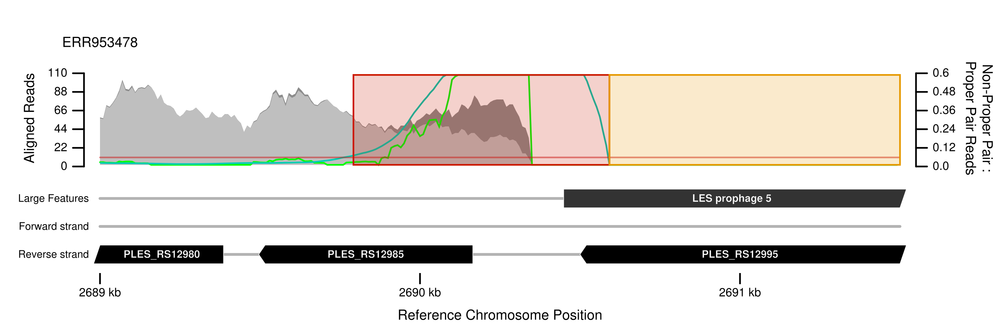

# The Bacterial and Archaeal Genome Analyser (BAGA)
(pronounced *baga*)

## About
**The Bacterial and Archaeal Genome Analyser (BAGA) is a commandline application (and, coming soon, Python 2 and 3 packages) for diverse analyses of genome sequence data designed to facilitate reproducible research.**

**Input data** can be complete genome sequences and/or paired end short reads from Illumina sequencers, typically whole genome shotgun libraries. **Tasks** might include variant calling and resolving population structure of resequenced pathogen isolates, analysis of evolution experiments and comparative genomics including phylogenomics.

BAGA is a wrapper for proven third party tools<sup>1</sup>, but also includes novel algorithms for identifying chromosomal rearrangements and sequence repeats known to increase the likelihood of false positive variant calls<sup>2</sup>, the means to filter those probable false positive variants out of a dataset, the means to create custom pipelines for reproducible analyses<sup>3</sup>, and can generate various informative plots<sup>4</sup>. It is under active development: new features and much more documentation will be appearing shortly.

1. *e.g.* [BWA](http://bio-bwa.sourceforge.net/) for short read alignment to longer sequences, [GATK](https://www.broadinstitute.org/partnerships/education/broade/best-practices-variant-calling-gatk-1) for variant calling and [ClonalFrameML](https://github.com/xavierdidelot/clonalframeml) for homologous recombination inference
2. Variant calls in such regions are unreliable and should be filtered: conventional variant calling algorithms would be unaware of potential misalignments caused by the loss of homology and might therefore report false positive variant calls *e.g.*, near chromosomal rearrangements caused by mobile genetic elements. Detailed characterisation of those regions can be made by local de novo assemblies of reads and alignment of resulting contigs to the reference sequence
3. researchers can make use of version-control and digital object identifiers to generate citable and reproducible analyses for peer review publication
4. BAGA can plot all automatically indicated regions such as those prone to misalignment of short reads because of structural differences between a reference sequence and a sampled genome, *e.g.* a missing prophage (see point 2 above) 

## Funding

Work on this software was started at [**The University of Liverpool**](https://www.liverpool.ac.uk), UK with funding from [**The Wellcome Trust**](http://www.wellcome.ac.uk/) (093306/Z/10) awarded to:

* Dr **Steve Paterson** (The University of Liverpool, UK)
* Dr **Craig Winstanley** (The University of Liverpool, UK)
* Dr **Michael A Brockhurst** (The University of York, UK)

## License

The BAGA source code license is GPLv3+: GNU GPL version 3 or later. BAGA free software: you are free to change and redistribute it. There is NO WARRANTY, to the extent permitted by law.

To download and explore the BAGA source code visit the [github repository](http://github.com/daveuu/baga).

## Prerequisites

Although BAGA will install bioinformatics software itself where possible ([GATK](https://www.broadinstitute.org/gatk/download/) exceptionally requires downloading by the user because of license restrictions), there are some prerequisites. Along with installation instructions, they are listed below. If you are using a computing cluster at a research institution, these pieces of software are probably available already (you could go ahead and try some [guided examples](guides)).

!!! note
    If you are not a system administrator where you would like to use BAGA (if the `sudo` command does not work for you), find out who is and ask them to install any missing packages listed below.

Before installing packages you should ensure your system is up-to-date. For Debian GNU/Linux and derivatives (Ubuntu, Mint etc.):
```bash
sudo apt-get update && sudo apt-get upgrade
```

For Redhat GNU/Linux and derivatives (Fedora, CentOS etc.):
```bash
sudo yum check-update && sudo yum update
# and possibly
sudo yum clean all && sudo yum -y update
```

For SuSE GNU/Linux and derivatives (OpenSuSE etc.):
```bash
sudo zypper refresh && sudo zypper update
```

Next check if the required packages are installed.

For SuSE:
```bash
sudo zypper search -t pattern python python-Cython git devel_basis
```

If any are missing, follow the instuctions below to install them. Otherwise, you are in luck and can have a look at some of the [guided BAGA examples](../guides).


### Python 2.7

BAGA is written in Python 2.7. Check whether you have Python 2.7 installed and available by typing in (or copying and pasting into a terminal) the following:

```bash
python2 --version
```

If your version is less than 2.7 or if your terminal returns an error, you will need to install the required version of Python. 

For Debian:
```bash
sudo apt-get install python
```

For Redhat:
```bash
sudo yum install python
```

For SuSE:
```bash
sudo zypper install python
```

### Git

"Git" is a program commonly used in software development to keep track of changes which is also handy for downloading software. BAGA development uses [git](http://www.git-scm.com/) and is hosted at [github.com](http://github.com/daveuu/baga).

For Debian:
```bash
sudo apt-get install git
```

For Redhat:
```bash
sudo yum install git
```

For SuSE:
```bash
sudo zypper install git
```

### "Build essentials"

These are general purpose software libraries BAGA needs for compiling and installing some of the sofware tools.

For Debian:
```bash
sudo apt-get install build-essentials cython
```

For Redhat:
```bash
sudo yum groupinstall "Development Tools" && sudo yum install cython
```

For SuSE:
```bash
sudo zypper install -t pattern devel_basis && sudo zypper install python-Cython
```
